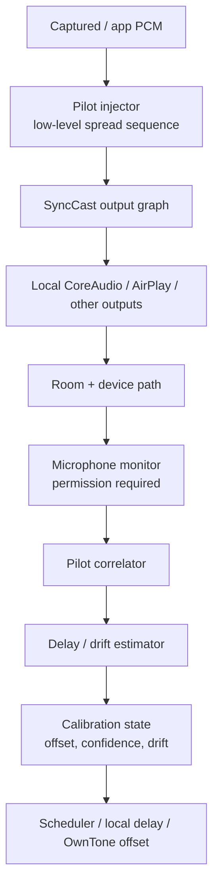

# 声学指纹校准研究备忘录

> 日期：2026-05-04
> 状态：研究/设计 memo；显式校准中的 continuous-phase high-band FSK 子集已在 2026-05-05 落地，连续弱 pilot 仍未实现。
> 范围：主动 coded FSK 指纹、不可闻性风险、连续弱 pilot 校准、AirPlay 共享 PCM 下的设备区分边界、实施计划。

## 摘要

SyncCast 需要知道“用户实际听到的声音”相对发送端时间线的偏移，才能把本机 CoreAudio、AirPlay、以及未来可能的多设备输出拉到同一个主观同步窗口里。纯协议侧时间戳能给出发送和接收的计划播放时间，但无法覆盖扬声器 DSP、房间路径、用户摆位、系统混音器和第三方接收器实现差异。因此声学测量仍然有价值。

当前主动 coded FSK 指纹方案适合作为“显式校准模式”：短时间播放带编码的测试音，通过麦克风录回后解码，得到端到端延迟。它的优点是可控、可归因、容易离线验证；风险是高频音不一定真正不可闻，而且会被设备 DSP、压缩链路、麦克风频响和环境噪声破坏。2026-05-05 的实现把旧的“带静音间隔的高频符号”改成 continuous-phase FSK，频率为 `19.05/19.35/19.65/19.95/20.25kHz`，48 个符号，1152ms，无 inter-symbol gap，以减少用户听到的低频重复包络。2026-05-12 在用户仍能听到探针后，默认 profile 改为更保守的 `comfort-21k`：`20.85/21.20/21.55/21.90/22.25kHz`，64 个符号，1536ms，local amplitude `0.014`，AirPlay amplitude `0.018`；旧 profile 保留为 `SYNCAST_CALIBRATION_PROBE_PROFILE=legacy` 供实验性回退。

更适合长期产品化的方向，是在正常播放中叠加连续、极弱、可相关的 pilot 序列，把校准从一次性动作变成慢速观测系统。但这个架构只能估计“当前共享声场里某条可听路径的整体偏移”，在 AirPlay 多设备共享同一 PCM 的情况下，无法仅靠嵌入音频区分每个 AirPlay 设备。设备级区分需要分时、分路、用户交互、协议侧遥测，或只在单设备播放窗口里测量。

## 2026-05-16 更新：先走无探针被动路线

用户在真实设备上仍能听到高频探针，所以当前工程优先级已经从“继续把主动 FSK 往更高频推”改成“正常播放中不注入任何探针，先用 reference/program WAV 与 Logitech 麦克风 WAV 做被动相关”。这条路线不会在节目里叠加 pilot，也不承诺能分辨多个 AirPlay 接收器；它只试图回答“当前本地声场相对 AirPlay 组/本地输出的相对偏移是否稳定到足以作为控制证据”。

当前实现状态：

- `scripts/passive_delay_estimator.py` 默认 `--mode dual`，同时运行 waveform NCC 与 envelope correlation。
- dual 结果必须在 aggregate delay 和 overlapping accepted windows 上同时一致，否则 fail closed。
- 结果输出 `slope_ms_per_min`、`drift_ppm`、`fitted_drift_span_ms`，用于发现一次 capture 内部的漂移/时钟斜率；下游可用 `--max-estimate-slope-ms-per-min` 拒绝过大斜率。
- `passive_capture_estimate.py` / `passive_drift_monitor.py` 默认走 dual estimator，并仍然要求 route context、current delay、delay lock、enabled AirPlay count、AirPlay timing epoch、capture backend 不跨样本漂移。
- 被动 delay 是相对 baseline 证据，不是可以直接写成 `airplayDelayMs` 的绝对值。

这并不否定 future weak pilot 的价值。区别是：当前无探针路线完全不改变用户正在播放的音频，适合先验证“能否可靠观测”；未来 weak pilot 若要产品化，还必须单独证明不可闻性、处理增益、误检率、AirPlay 共享 PCM 下的身份边界，以及隐私/麦克风 UX。

## 1. 当前主动 coded FSK 指纹方案

### 1.1 基本模型

主动 coded FSK 指纹是在播放端注入一个短促、可识别的编码声学探针。典型结构：

- 使用两个或多个高频 tone 表示符号，例如 mark/space FSK。
- 用前导码帮助录音侧粗定位，例如 Barker、m-sequence 或重复 chirp。
- 载荷包含校准事件 ID、设备/路由代号、序号、采样率版本、CRC。
- 播放端记录探针进入输出管线的 monotonic 时间戳。
- 录音端从麦克风 PCM 中做带通、能量检测、符号同步、解码或相关峰定位。
- 端到端延迟约等于“麦克风检测到探针的时间”减去“探针在发送时间线上的基准时间”，再减去本机录音输入延迟和已知软件缓冲。

它不必追求数据通信速率。校准只需要可靠识别“这是哪一次探针”以及精确定位探针到达时间。更好的设计通常是“低 bit-rate + 长相关码 + 高处理增益”，而不是把它做成真正的数据 modem。

### 1.2 适合解决的问题

主动 FSK 适合回答：

- 某个输出路由当前的声学端到端延迟是多少。
- AirPlay 接收器、电视、蓝牙/USB DAC、房间路径、系统 DSP 叠加之后的整体偏移是多少。
- 某次重新建组、重启 receiver、切换网络之后，稳定偏移是否发生变化。
- 本地扬声器和远端扬声器在同一个麦克风位置下的相对到达时间差。

它不适合回答：

- 多个 AirPlay 设备同时播放完全相同 PCM 时，每台设备各自的偏移。
- 用户关闭麦克风权限时的持续校准。
- 正常音乐播放中是否永远不可察觉。
- 房间内不同听音位置的全局真实延迟。麦克风测到的是麦克风所在位置的声场。

### 1.3 建议的显式校准流程

显式校准可以作为“精确校准”入口，而不是默认后台行为：

1. 用户选择一个目标输出或目标输出组。
2. SyncCast 暂停或压低正常节目音量。
3. 只对目标输出播放 1-3 秒 coded probe。
4. 麦克风录入并做相关/解码。
5. 多次测量取中位数，丢弃低 SNR、CRC 失败、峰值不唯一的样本。
6. 将结果写入 per-route calibration profile，并记录时间、接收器标识、输出组、麦克风设备、采样率、置信度。

关键是把它定义为“用户授权的一次声学测量”。不要把高频探针默认藏在普通播放里长期运行。

## 2. 高频“不可闻性”的风险

### 2.1 不可闻不是一个稳定产品假设

把探针放到 17-21 kHz 这类高频区域，不能保证不可闻。风险来自几类地方：

- 年轻用户、听力敏感用户、宠物或同处一室的人可能听到高频 tone 或调制边带。
- 很多笔记本、电视、Soundbar、HomePod、第三方 AirPlay 音箱会做动态 EQ、响度管理、重采样、限幅、空间音频或降噪，可能把高频能量折叠、调制或产生互调失真。
- 有损编解码、AirPlay 链路、系统音量处理、麦克风阵列前处理可能削弱或扭曲高频符号，导致解码不稳。
- 扬声器和麦克风的 18 kHz 以上响应高度不一致。某些设备根本发不出或录不到，另一些设备会产生刺耳谐波。
- 正常节目内容本身也有高频瞬态，会增加误检和相关峰歧义。
- 高频能量即使听不见，也可能让频谱分析、直播、会议软件、助听器或录音链路出现异常观感。

因此，“不可闻高频 FSK”应该被视为工程假设，而不是用户体验承诺。

### 2.2 风险缓解原则

主动 FSK 的安全边界建议如下：

- 默认只在显式校准模式启用，UI 明确提示会播放短测试音。
- 振幅从极低电平开始自适应提升，达到可靠检测后立刻停止。
- 对输出做限幅和频谱审计，避免集中、持续、满幅高频 tone。
- 采用宽带相关码或短 chirp，降低单频刺耳感和互调风险。
- 对每台设备记录可用频段，不假设所有设备支持同一高频范围。
- 解码失败时回退到用户 tap 校准或协议侧估计，不反复播放高频探针。
- 在日志里记录 probe 音量、频段、持续时间、检测置信度，方便复现投诉。

## 3. 正常播放中连续弱 pilot 校准

### 3.1 可行架构

连续弱 pilot 的目标不是“传数据”，而是在普通节目下提供一个长期可相关的、低能量的时间参考。推荐架构：



播放侧在 PCM 中叠加一条伪随机 pilot。录音侧知道 pilot 序列和播放时间线，因此可以在滑动窗口里做相关，提取到达时间、SNR、漂移趋势。校准器不需要每秒更新用户可见偏移；它可以 10-60 秒为窗口慢慢积分，只在置信度足够时调整。

### 3.2 Pilot 设计建议

比起高频 FSK，连续 pilot 更适合使用扩频/相关码思路：

- 低振幅，目标是低于正常内容和房间噪声的可感知阈值。
- 频谱分散，不把能量压在一个固定窄带 tone 上。
- 可选择避开人耳敏感区，但不要完全依赖 18 kHz 以上频段。
- 序列周期足够长，避免相关峰重复造成整数周期歧义。
- 每个会话使用不同 seed，降低被节目内容或历史录音误相关的概率。
- 播放侧保留 exact sample index 到 monotonic clock 的映射。
- 录音侧输出置信度，不把低置信度估计写入校准 profile。

在音乐存在时，pilot 相关会被节目内容淹没。可用性来自处理增益和长窗口，而不是瞬时 SNR。产品上要接受它是慢校准：适合漂移监控、稳定偏移微调，不适合首次快速锁定。

### 3.3 校准状态机

建议把连续校准做成显式状态机：

- `inactive`：没有麦克风权限、用户关闭、或当前路由不支持。
- `observing`：注入 pilot 并收集相关窗口，但不应用修正。
- `locked`：相关峰稳定，偏移估计进入可用状态。
- `tracking`：慢速跟踪漂移，只允许小幅、平滑修正。
- `degraded`：SNR 下降、峰值多解、节目内容干扰、麦克风移动。
- `invalidated`：路由变化、AirPlay 组变化、采样率变化、输出重启、系统睡眠恢复。

每次修正都应带置信度和幅度上限。例如只允许每分钟修正数毫秒级偏移；超过阈值时触发重新观测，而不是突然跳变播放。

### 3.4 隐私与权限

连续 pilot 依赖麦克风常开或周期性开启。即使只做本地 DSP、不上传音频，也必须把它当成敏感能力设计：

- UI 明确展示麦克风校准状态。
- 默认关闭连续监听，只在用户开启“自动校准”后启用。
- 只保存延迟估计、置信度、频谱/SNR 摘要，不保存原始麦克风音频。
- 提供一键停止和清除 calibration profile。
- 当系统麦克风权限撤销时，静默降级到协议侧/手动校准，不反复打扰。

## 4. AirPlay 共享 PCM 下的设备区分限制

AirPlay 组播/多房间场景的核心限制是：多个接收器往往播放同一条 PCM。只要 SyncCast 或 OwnTone 给每台 AirPlay 设备的音频内容完全相同，嵌入在 PCM 里的 FSK 或 pilot 也完全相同。麦克风只会听到多个扬声器声波的叠加，相关器看到的是一个或多个到达峰，但这些峰没有携带“是哪台设备”的身份信息。

这带来几个结论：

- 同 PCM 下的 embedded audio watermark 不能自然标识设备。
- 如果两个设备到达时间接近，相关峰会融合，无法可靠拆分。
- 如果两个设备到达时间分离，能看到多个峰，但仍只能推断“有多条声学路径”，不能把峰绑定到具体 AirPlay receiver。
- 房间反射也会产生多个峰，容易和多设备路径混淆。
- 移动麦克风位置会改变路径强弱和峰顺序，设备归因会更不稳定。

可行的设备区分办法只有改变实验条件或引入非音频信息：

- 分时测量：一次只让一台 AirPlay 设备播放 probe/pilot，其他设备静音或退出组。
- 分路注入：如果发送架构允许每台设备收到不同 PCM，可给每台设备不同 pilot seed。但当前 OwnTone/AirPlay 共享输入路径通常不提供这个能力。
- 协议侧结合：用 OwnTone/AirPlay 的 output ID、IP、selected state、offset_ms 和组 generation 约束声学测量的归因。
- 用户辅助：让用户把麦克风靠近某台设备，或在 UI 中确认正在校准哪台设备。
- 空间阵列：用多麦克风或波束成形估计方向，但这超出现阶段 SyncCast 的合理复杂度。

因此，连续 pilot 在 AirPlay 共享 PCM 下最现实的用途是“组级健康监测”和“本机 vs AirPlay 组的整体相对偏移”，不是自动获得每台 AirPlay 设备的独立 offset。

## 5. 推荐系统设计

### 5.1 双层校准

建议将校准拆成两层：

第一层是协议/调度层估计。它不需要麦克风，来源包括：

- AirPlay anchor / stream timing。
- OwnTone output selection 和 `offset_ms`。
- 本地 CoreAudio device latency。
- SyncCast 自己的 FIFO backlog、generation、restart 事件。

第二层是声学校验。它需要麦克风，来源包括：

- 显式 coded probe。
- 连续弱 pilot。
- 用户 tap 校准作为无麦克风 fallback。

协议层负责默认体验和大致对齐；声学层负责证明真实世界里听起来是否对齐，并在用户授权时细化偏移。

### 5.2 数据模型草案

校准结果不应只存一个 `offsetMs`。建议记录：

```json
{
  "routeId": "airplay-group-or-device-id",
  "scope": "device|group|local_vs_airplay",
  "generation": "stream-generation-id",
  "offsetMs": 1824.6,
  "driftPpm": 0.8,
  "confidence": 0.91,
  "method": "protocol|coded_fsk|weak_pilot|tap",
  "sampleRate": 48000,
  "createdAt": "2026-05-04T00:00:00Z",
  "invalidatesOn": ["route_change", "sample_rate_change", "receiver_restart"]
}
```

`scope` 很重要。AirPlay 共享 PCM 下测得的结果经常只能是 `group` 或 `local_vs_airplay`，不能伪装成 per-device。

### 5.3 应用修正的原则

- 稳定偏移可以写入 OwnTone `offset_ms` 或 SyncCast local delay。
- 漂移应由慢速调度器处理，不要频繁改静态 offset。
- 低置信度测量只进入 diagnostics，不改变播放。
- 大幅偏移变化应触发重新建组或提示重新校准。
- 用户手动 offset 优先级高于自动声学估计，自动系统只能给建议或小幅跟踪。

## 6. 实施计划

### 短期：研究验证与显式校准

- 建立离线仿真/估计脚本：`scripts/passive_delay_estimator.py` 已先落地为无声的被动延迟估计工具，可从 reference/program WAV 与 microphone WAV 中用滑动相关估计延迟并报告多路径峰；后续再扩展到 FSK/chirp/扩频 probe、混响、重采样、限幅等仿真矩阵。
- 实现显式 coded probe 原型：先只支持单个输出目标，测量端到端延迟并输出诊断 JSON。
- 记录完整校准上下文：route、device、generation、sample rate、probe level、SNR、confidence、失败原因。
- 给 AirPlay shared PCM 限制写进产品假设：per-device 声学 offset 只能在分时或分路条件下声明。
- 保留无麦克风 fallback：tap 校准或协议侧默认 offset。

### 中期：连续 pilot 与调度闭环

- 做低振幅扩频 pilot 注入器和滑动相关器，先在本地文件/录音回放链路验证。
- 增加校准状态机和 invalidation 规则，路由变化、睡眠恢复、OwnTone generation 变化时自动降级。
- 将 pilot 估计接入 diagnostics，而不是立即影响播放。
- 在足够稳定后，只允许小幅平滑修正本地 delay 或建议 OwnTone `offset_ms`。
- 增加用户可见的自动校准开关、麦克风状态、最近一次测量置信度。

### 长期：设备级归因与更强鲁棒性

- 研究是否能绕过共享 PCM，为每个 AirPlay receiver 注入不同 pilot seed；如果不能，把 per-device 自动声学校准明确排除在 AirPlay 共享组之外。
- 引入多点测量：不同麦克风位置或用户移动设备时建立更稳的房间模型。
- 对常见 receiver 建立经验 profile，但只作为启动猜测，不替代实时测量。
- 若 SyncCast 未来控制自有 endpoint，可采用 Snapcast/RAAT 风格的 per-endpoint timestamp、buffer telemetry 和独立 pilot。
- 在长时间会话中评估 drift、网络扰动、receiver 重启、系统睡眠恢复后的自动恢复策略。

## 7. 建议结论

主动 coded FSK 是很好的实验工具和显式校准能力，但不应被包装成“听不见的后台信标”。连续弱 pilot 更接近最终架构，因为它能在正常播放中慢速观察真实声学偏移和漂移；不过它需要麦克风权限、隐私设计、长窗口统计和严格置信度控制。

对 AirPlay 来说，最大的产品边界是共享 PCM：同一条音频里嵌入的任何指纹都会被所有接收器一起播放，无法天然区分设备。SyncCast 应该先把声学校准定位为组级/路径级验证，再通过分时测量或协议侧约束逐步逼近设备级 offset。
