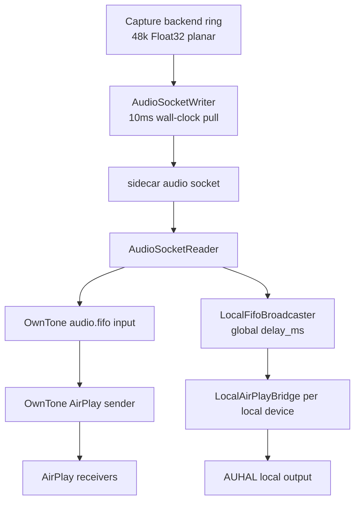

# AirPlay Sync Strategy

> Date: 2026-05-03
> Status: strategy memo, not an implementation guarantee.

## Summary

SyncCast has crossed the "all selected AirPlay devices can make sound" line. The immediate user-visible sync problem is Local + AirPlay alignment: local playback and AirPlay playback have a latency gap that must be controllable from the app.

The broader long-session AirPlay reliability problem remains, but it is separate from the first fix.

The next strategy is measurement-first:

- Treat AirPlay as an experimental feature until long-session skew, drift, and recovery are measured.
- Split AirPlay into an AirPlay-only remote group and a Local + AirPlay mixed mode.
- In mixed mode, make the local bridge delay user-controllable through `local_fifo.set_delay_ms`. Do not try to keep local Stereo's low-latency target while also syncing to AirPlay.
- Use per-device offsets for stable bias only, not for clock drift or network jitter.
- Treat multiple AirPlay receivers as one buffered AirPlay timing domain for the near-term product. SyncCast should focus on aligning local Mac/display/CoreAudio speakers to that AirPlay group, not on reimplementing AirPlay receiver-to-receiver synchronization.

## What Commercial And Open Systems Do

Airfoil's public documentation says remote protocols have inherent latency, and Airfoil delays all playback to match the highest-delay device. It also exposes per-speaker sync offsets, but warns that fluctuating latency cannot be fixed permanently with sliders. See [Airfoil latency support](https://www.rogueamoeba.com/support/knowledgebase/?product=Airfoil+for+Mac&showArticle=Airfoil-AudioLatency) and [Airfoil manual](https://www.rogueamoeba.com/support/manuals/airfoil/?print=true).

OwnTone can play to AirPlay devices and local audio. Its docs note that local ALSA playback tries to synchronize with AirPlay and has latency adjustment knobs. See [OwnTone local audio](https://owntone.github.io/owntone-server/audio-outputs/local-audio/) and [OwnTone AirPlay](https://owntone.github.io/owntone-server/audio-outputs/airplay/).

Shairport Sync explains the receiver-side model: AirPlay samples have timestamps and an agreed latency, and the receiver maintains sync using audio hardware timing plus frame insertion/deletion or resampling. It also exposes sync error, correction, packet, buffer, and clock drift statistics. See [Shairport Sync README](https://sources.debian.org/src/shairport-sync/3.3.7-1/README.md) and [Shairport Sync manpage](https://manpages.ubuntu.com/manpages/jammy/man7/shairport-sync.7.html).

Snapcast is a useful contrast because it controls both server and clients. The server timestamps PCM chunks and clients synchronize to the server. SyncCast does not control AirPlay receivers, so Snapcast's architecture cannot be copied directly. See [Snapcast README](https://github.com/snapcast/snapcast).

## Current SyncCast Path

Current whole-home routing is:

Observed design gaps:

- `stream.start` idempotency has landed for the same active device set, but AirPlay route changes, volume changes, OwnTone epoch changes, and local broadcaster queue resets still need measured recovery evidence.
- There is no group start barrier. Late receiver discovery can become a silent late join, which is not the same as re-locking the whole group.
- SyncCast records selected/connected state, but not whether a receiver is protocol-synchronized or within a skew budget.
- Local + AirPlay uses a global local delay. It does not model per-device stable bias or local bridge drift.
- OwnTone supports per-output `offset_ms`, but SyncCast does not currently write calibrated offsets back to OwnTone.

## Proposed Algorithm

### 1. Make Stream Start Idempotent

Sidecar should remember the active AirPlay device set. If `stream.start` arrives with the same sorted IDs while the stream is already running and the audio reader is healthy, it should not call `play_pipe()` again.

Expected benefit: fewer queue clears, fewer playback timeline resets, less subjective desync when the UI repeatedly reconciles the same routing state.

Status 2026-05-04: implemented for unchanged active sets. The remaining risk is stream epochs that really do change; those now need explicit broadcaster reset and calibration invalidation.

### 1a. Make Local + AirPlay Delay Actually Apply

The UI slider must call `AppModel.setAirplayDelay()`, which debounces and sends `local_fifo.set_delay_ms` to the sidecar. Directly assigning `airplayDelayMs` only changes UI state and does not alter local bridge timing.

Expected benefit: the user can tune local playback relative to AirPlay without restarting the stream.

### 2. Add A Group Start Barrier

For a new target set:

1. Ensure OwnTone is alive.
2. Resolve every target receiver to an OwnTone output, with a bounded wait.
3. Enable the exact target outputs.
4. Verify selected state.
5. Start pipe playback once.
6. Mark the group active with a generation ID.

If a receiver appears late, do not silently add it to the active generation. Either show it as "waiting for sync" or trigger a controlled group restart.

### 3. Separate Remote-Only And Mixed Modes

AirPlay-only remote group:

- Let OwnTone/AirPlay own the remote group timing.
- SyncCast verifies output selection and records health.
- Product target is multi-room audio, not video lip-sync.

Local + AirPlay mixed mode:

- Treat AirPlay as the highest-latency clock domain.
- Delay local output to `groupFloorDelayMs + localCorrectionMs`.
- Surface the higher latency honestly. This mode cannot preserve local Stereo's low-latency feel.

### 4. Apply Per-Device Offset Only For Stable Bias

Use calibration to estimate stable offsets, then map them to OwnTone `offset_ms` where possible.

Do not use this as a drift fix. If skew changes over time, record it and trigger resync or mark the group unstable.

### 5. Calibrate Local Against The AirPlay Group

The current implementation uses high-band coded FSK probes and matched filtering:

1. Measure local CoreAudio arrival with local-only coded probes.
2. Restore all selected AirPlay receivers to their normal volumes.
3. Inject the same coded probe into the shared AirPlay stream.
4. Repeat five AirPlay group captures.
5. Select the dominant tau cluster, then apply MAD/range/slope gates.
6. Return an absolute local delay target while preserving manual settings in diagnostic/no-apply mode.

This matches the product problem the user clarified: the important sync error is local speakers versus the AirPlay group. It does not pretend to identify individual AirPlay receivers unless SyncCast deliberately enters a TDMA/muting experiment or moves to a future per-receiver stream architecture.

Observed 2026-05-04: a real false-peak run produced AirPlay candidates `2512/2149/1918/2163/2157ms`; the cluster selector kept `2149/2163/2157ms` and recommended `2155ms` without applying it automatically.

### 6. Measure Before Claiming Reliability

Minimum metrics:

- Device: `deviceUID`, name, model, IP, OwnTone output ID, selected state, `offset_ms`.
- Transport: write queue depth, socket reconnects, packet/byte counters, FIFO backlog.
- Timing: first audio time, configured group floor, local delay, measured skew, drift per minute.
- Recovery: resync count, group generation, receiver restart, sidecar restart, OwnTone restart.

## Acceptance Gates

AirPlay remains experimental until:

- 2+ AirPlay receivers play for 2+ hours.
- `abs(maxSkewMs)` stays within a defined budget, initially 30 ms for same-room listening.
- Drift does not grow monotonically across the session.
- Receiver restart, network drop, sidecar restart, OwnTone restart, and sleep/wake produce explicit logs and either recover or fail visibly.

## Implementation Slices

1. Sidecar `stream.start` idempotency.
2. Start/restart generation ID and logging.
3. Group barrier with explicit late-join state.
4. OwnTone `offset_ms` RPC.
5. Long-session diagnostic script and report format.
6. Local + AirPlay aggregate bridge design, so local devices do not each run on unrelated AUHAL clocks.
